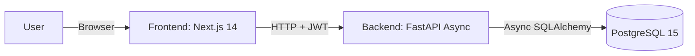
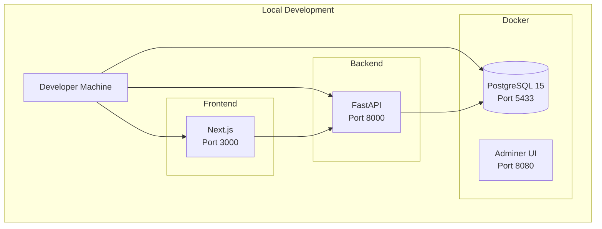
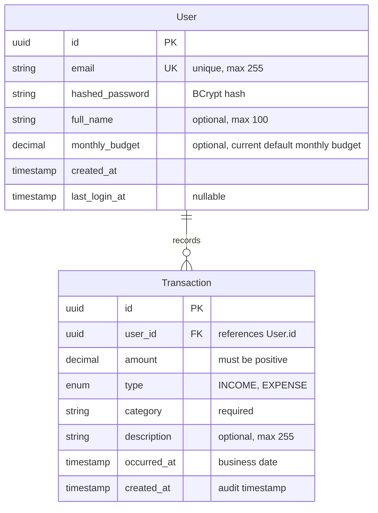

## Table of Contents

0. [Project Information](#0-project-information)
1. [Product Overview](#1-product-overview)
2. [System Architecture](#2-system-architecture)
3. [Data Model](#3-data-model)
4. [API Specification](#4-api-specification)
5. [User Stories](#5-user-stories)
6. [Work Tickets](#6-work-tickets)
7. [Pull Requests](#7-pull-requests)

---

## 0. Project Information

### **0.1. Full Name:**

Welington Jafer Cruz

### **0.2. Project Name:**

Ze Finance (Zefa)

### **0.3. Brief Project Description:**

Ze Finance is an MVP personal finance assistant focused on a **Walking Skeleton**: a complete, minimal, end-to-end flow that works in the browser (Frontend → API → Database). The system name is **Ze Finance**, and the AI chat assistant is named **Zefa** (masculine). The project provides a foundation for future phases involving AI and WhatsApp integration.

### **0.4. Project URL:**

> Local development environment:
> - Frontend: http://localhost:3000
> - Backend API: http://localhost:8000
> - API Documentation: http://localhost:8000/docs
> - Database Admin (Adminer): http://localhost:8080

### **0.5. Repository URL or Compressed File**

> Repository: https://github.com/welingtoncruz/ze-finance

---

## 1. Product Overview

### **1.1. Objective:**

Ze Finance is designed to help individuals track their personal finances through a simple, intuitive web application. The MVP focuses on establishing a complete end-to-end flow where users can:

- Register and authenticate securely
- Record income and expense transactions
- View a financial summary dashboard with totals and category breakdowns
- Manage their transaction history

**Value Proposition:**
- Provides immediate value through a working financial tracking system
- Establishes a solid foundation (Walking Skeleton) before adding complex features
- Enables future expansion to AI-powered insights and WhatsApp integration
- Demonstrates clean architecture and best practices from day one

**Target Users:**
- Individuals who want to register, log in, record basic transactions (income/expense), and see a simple financial summary

### **1.2. Main Features and Functionalities:**

#### **Authentication**
- User registration with email and password
- Login with JWT token authentication
- Secure password hashing (BCrypt)
- Mobile logout access via account drawer
- Automatic access token refresh using a long-lived refresh token stored in an HTTP-only cookie

#### **Transactions**
- List transactions (owned by logged-in user)
- Create transaction (income/expense) with icon-grid category selection
- Edit transaction (backend-integrated PATCH endpoint with optimistic UI and local persistence for offline-safe edits)
- Delete transaction (owned by logged-in user)
- Data isolation enforced: users can only access their own transactions

#### **User Profile & Settings**
- Get user profile (email, full_name, monthly_budget) via `GET /user/profile`
- Update profile (partial) via `PATCH /user/profile`
- Settings page (`/settings`) for editing display name and monthly budget
- Profile data cached in `localStorage` and synced with backend

#### **Dashboard**
- Summary totals (balance, income, expense)
- Breakdown by category
- Real-time updates when transactions are added or removed

#### **Chat (AI Agent)**
- Interactive chat interface with Zefa AI assistant (masculine)
- Real-time text-based conversations via POST `/chat/messages` endpoint (returns message and UI metadata envelope)
- Natural language queries for financial data ("Qual meu saldo?")
- Tool-based function calling to query and mutate user data:
  - Get balance (`get_balance`)
  - List transactions (`list_transactions`)
  - Create transactions via natural language (`create_transaction`)
  - Analyze spending patterns (`analyze_spending`)
- Conversation memory persistence with summarization support
- Ephemeral API key management (in-memory, TTL-based)
- Provider-agnostic AI gateway (OpenAI/Anthropic support)
- Strict data isolation: all queries scoped by authenticated user_id
- **Frontend Integration (feat-9)**:
  - Backend-integrated chat UI replacing simulated responses
  - Optimistic UI with immediate message display
  - localStorage persistence for conversation continuity (survives browser close/reopen)
  - Markdown GFM rendering for assistant messages (bold, lists, links, code blocks)
  - Theme-aligned bubble colors (primary for user, muted for assistant)
  - Auto-scroll and typing indicators
  - Error handling with retry functionality
  - Transaction confirmation cards (Electric Lime styling)
  - Responsive-first design (mobile/tablet/desktop)

### **1.3. Design and User Experience:**

The application follows a **responsive-first** design philosophy, ensuring the UI feels intentional on desktop, tablet, and mobile devices. Key UX principles:

- **Mobile**: Single-column layout, bottom navigation, large touch targets
- **Tablet**: 2-column dashboards where helpful, collapsible filters/details
- **Desktop**: Multi-column dashboards, persistent sidebar, richer comparison views

**Design System:**
- Uses semantic tokens (CSS variables) for consistent theming
- Supports light and dark modes
- Fintech identity: bold but clean ("confidence + clarity + energy")
- Uses ShadcnUI components built on Radix UI primitives
- Tailwind CSS for styling

**User Flow (MVP):**
1. Register page → register user → store token
2. Login page → login → store token
3. Dashboard (home) → show summary
4. Transactions list → list transactions
5. Create transaction form → create transaction → refresh list/summary
6. Edit transaction → PATCH backend → refresh list/summary
7. Delete transaction → refresh list/summary
8. Settings page → update profile (name, monthly budget)

### **1.4. Installation Instructions:**

#### Prerequisites

- **Python 3.11+** (for backend)
- **Node.js 18+** (for frontend)
- **Docker Desktop + Docker Compose v2** (for database)

#### 1. Start Database with Docker

From the repository root:

```bash
docker compose up -d db
```

This starts PostgreSQL 15 in a Docker container:
- **Port**: `5433` (to avoid conflicts with local PostgreSQL)
- **Database**: `zefa_db`
- **User**: `postgres`
- **Password**: `postgres_password`
- **Persistent storage**: Data is stored in a Docker volume

**Optional - Database Admin UI (Adminer):**
```bash
docker compose --profile tools up -d adminer
```
Access Adminer at http://localhost:8080 (use the same credentials as above).

#### 2. Backend Setup

```bash
cd backend
cp .env.example .env
pip install -r requirements.txt
python -m uvicorn app.main:app --reload --host 0.0.0.0 --port 8000 --env-file .env
```

**Backend Docker (optional):**
If you prefer to run the backend in Docker:

```bash
cd backend
docker build -t zefa-backend .
docker run -p 8000:8000 --env-file .env zefa-backend
```

**Note:** For development, running locally with `--reload` is recommended for hot-reloading.

#### 3. Frontend Setup

```bash
cd frontend
cp .env.example .env.local
npm install
npm run dev
```

The frontend will be available at http://localhost:3000 and the backend API at http://localhost:8000.

#### 4. Verify Setup

1. Check database is running: `docker compose ps`
2. Backend API docs: http://localhost:8000/docs
3. Frontend: http://localhost:3000

#### Testing

**Backend Tests:**
```bash
cd backend
pip install -r requirements.txt
python -m pytest -v
```

**Frontend Tests:**
```bash
cd frontend
npm test  # Unit/integration tests
npx playwright test  # E2E tests
```

---

## 2. System Architecture

### **2.1. Architecture Diagram:**

The system follows a simplified layered architecture pattern, avoiding premature abstraction while maintaining clear separation of concerns.



**Architecture Pattern:**
- **Simplified Layered Architecture**: Presentation → Service/CRUD → Data layers
- **Modular Monolith**: Single deployable unit with clear module boundaries
- **Walking Skeleton First**: End-to-end connectivity prioritized over perfecting isolated components

**Justification:**
- **FastAPI (Async)**: High performance, modern Python async support, automatic OpenAPI documentation
- **Next.js 14 (App Router)**: Server-side rendering, excellent developer experience, built-in optimizations
- **PostgreSQL**: ACID compliance, robust relational model, excellent performance for financial data
- **SQLAlchemy Async**: Type-safe ORM with async support, preventing blocking I/O operations

**Benefits:**
- Fast development velocity with modern frameworks
- Type safety throughout the stack (Python type hints + TypeScript strict)
- Scalable foundation for future AI/WhatsApp integrations
- Clear separation of concerns without over-engineering

**Trade-offs:**
- Not using microservices (YAGNI principle - not needed for MVP)
- Not implementing pure DDD patterns (simplified approach for MVP)
- Database migrations use `Base.metadata.create_all()` on startup for MVP (Alembic can be introduced later when needed).

### **2.2. Main Components Description:**

#### **Frontend (Next.js 14)**
- **Framework**: Next.js 14 with App Router
- **Language**: TypeScript 5+ (strict mode, no `any`)
- **Styling**: Tailwind CSS + ShadcnUI (Radix UI)
- **Charts**: Recharts
- **HTTP Client**: Axios via `@/lib/api` (interceptors for auth)
- **State Management**: React Context (AuthContext) + local state
- **Key Features**:
  - Server Components by default (Client Components only when needed)
  - Responsive-first layouts (mobile/tablet/desktop)
  - Theme support (light/dark mode)
  - Protected routes with client-side guards

#### **Backend (FastAPI)**
- **Framework**: FastAPI (Async)
- **Language**: Python 3.11+
- **Validation**: Pydantic V2
- **ORM**: SQLAlchemy 2.0 (Async)
- **Database Driver**: AsyncPG
- **Server**: Uvicorn
- **Authentication**: JWT (python-jose) + BCrypt (passlib)
- **Key Features**:
  - Async/await throughout for non-blocking I/O
  - Automatic OpenAPI documentation
  - Type hints mandatory in all function signatures
  - Dependency injection for database sessions and authentication

#### **Database (PostgreSQL 15)**
- **Version**: PostgreSQL 15
- **Deployment**: Docker Compose (local development)
- **ORM**: SQLAlchemy Async with AsyncPG driver
- **Features**:
  - UUID primary keys for all entities
  - Foreign key constraints with cascade delete
  - Indexes on frequently queried columns
  - Decimal precision for monetary amounts

### **2.3. High-Level Project Description and File Structure:**

```
ze-finance/
├── backend/                    # FastAPI backend application
│   ├── app/
│   │   ├── main.py            # Entrypoint and app configuration
│   │   ├── models.py           # Database models (SQLAlchemy)
│   │   ├── schemas.py          # Input/Output schemas (Pydantic)
│   │   ├── crud.py             # Data access logic (CRUD operations)
│   │   ├── database.py        # DB connection configuration
│   │   ├── auth_utils.py      # JWT logic and password hashing
│   │   ├── rate_limit.py      # Rate limiting (SlowAPI, optional)
│   │   └── routers/            # API route modules
│   │       ├── auth.py         # Authentication routes
│   │       ├── transactions.py # Transaction routes
│   │       ├── dashboard.py    # Dashboard routes
│   │       └── user.py         # User profile routes
│   ├── tests/                  # Backend tests
│   │   ├── conftest.py         # Pytest fixtures
│   │   ├── test_auth.py        # Auth tests
│   │   ├── test_transactions.py # Transaction tests
│   │   └── test_dashboard.py   # Dashboard tests
│   ├── requirements.txt       # Python dependencies
│   ├── Dockerfile             # Backend container image
│   └── .env.example           # Environment variables template
│
├── frontend/                   # Next.js frontend application
│   ├── app/                    # Next.js App Router pages
│   │   ├── layout.tsx         # Global app shell layout
│   │   ├── page.tsx           # Dashboard (home)
│   │   ├── login/              # Login page
│   │   ├── register/          # Register page
│   │   ├── transactions/      # Transactions page
│   │   ├── insights/           # Insights page
│   │   ├── settings/          # User settings page
│   │   └── chat/              # Chat page
│   ├── components/
│   │   ├── ui/                # ShadcnUI primitives
│   │   ├── layout/            # Header/sidebar/bottom-nav
│   │   ├── dashboard/         # Dashboard widgets
│   │   ├── chat/              # Chat components
│   │   │   ├── ZefaChatScreen.tsx
│   │   │   ├── ChatBubble.tsx
│   │   │   ├── TypingIndicator.tsx
│   │   │   └── TransactionConfirmationCard.tsx
│   │   ├── filters/           # Date/category filters (MonthSelector)
│   │   ├── pwa/               # PWA components (AddToHomeScreenBanner)
│   │   ├── settings/          # UserSettingsForm
│   │   └── forms/             # Reusable form components
│   ├── lib/
│   │   ├── api.ts             # Axios instance & interceptors
│   │   ├── chat/              # Chat service layer
│   │   │   └── service.ts     # API normalization
│   │   ├── hooks/             # React hooks
│   │   │   └── useChat.ts     # Chat state management
│   │   ├── types/             # TypeScript types
│   │   │   └── api.ts         # API types
│   │   └── utils.ts           # Helpers (format currency, etc.)
│   ├── context/
│   │   └── AuthContext.tsx    # Auth logic & user state
│   └── public/                # Static assets
│
├── ai-specs/                   # AI specs and planning documents
│   ├── specs/                 # Authoritative specifications
│   │   ├── api-spec.yml       # OpenAPI specification
│   │   ├── data-model.md      # Data model documentation
│   │   └── development_guide.md # Development guide
│   └── changes/               # Implementation plans
│       ├── feat-1-core-arch-backend-plan.md
│       ├── feat-2-config-database-plan.md
│       └── ...
│
├── .cursor/                    # Cursor IDE rules and commands
│   └── rules/                 # Development standards
│       ├── base-standards.mdc
│       ├── backend-standards.mdc
│       ├── frontend-standards.mdc
│       └── documentation-standards.mdc
│
├── docker-compose.yml          # Docker Compose configuration
├── README.md                   # Project overview and quick start
├── TECHNICAL_DOCUMENTATION.md  # Comprehensive technical docs
└── PROJECT_DOCUMENTATION.md    # This file

```

**Architecture Pattern:**
The project follows a **Simplified Clean Architecture** for the MVP:
- **Presentation Layer**: FastAPI routes/controllers (thin, delegates to service layer)
- **Application/Domain Layer**: CRUD/service layer (business logic + persistence orchestration)
- **Data Layer**: SQLAlchemy models + database constraints

This structure avoids over-engineering while maintaining clear separation of concerns and preparing for future growth.

### **2.4. Infrastructure and Deployment:**

#### **Local Infrastructure**

**Database Setup (Docker Compose)**
- PostgreSQL 15 provided via Docker Compose for consistent local development
- Start: `docker compose up -d db` (from repo root)
- Credentials: `postgres/postgres_password` on `localhost:5433`
- Database name: `zefa_db`
- Optional Adminer UI: `docker compose --profile tools up -d adminer`

**Backend Setup**
- Copy `backend/.env.example` to `backend/.env`
- Install dependencies: `pip install -r requirements.txt`
- Run server: `python -m uvicorn app.main:app --reload --host 0.0.0.0 --port 8000 --env-file .env`
- API available at http://localhost:8000 (docs at `/docs`)

**Frontend Setup**
- Copy `frontend/.env.example` to `frontend/.env.local`
- Install dependencies: `npm install`
- Run dev server: `npm run dev`
- Frontend available at http://localhost:3000

**Infrastructure Diagram:**



#### **Deployment Strategy**

**Production stack (current):**
- **Frontend**: Vercel (Next.js); root directory set to `frontend`
- **Backend**: GCP Cloud Run (FastAPI container); build from `backend/` via Cloud Build or manual `gcloud run deploy`
- **Database**: Neon (PostgreSQL); use pooled connection string for async driver
- **Configuration**:
  - Backend: `ALLOWED_ORIGINS` (Vercel URL), secrets via GCP Secret Manager (`DATABASE_URL`, `SECRET_KEY`, `GEMINI_API_KEY`)
  - Frontend: `NEXT_PUBLIC_API_BASE_URL` (Cloud Run URL, no trailing slash)

**CI/CD Pipeline (Basic):**
Minimum CI pipeline should run on every PR:
- **Backend**: Lint/format check, typecheck, `pytest`
- **Frontend**: `npm run lint` and `npm run build`

**Secrets Management:**
- Never commit secrets
- Use `.env.example` files for both backend and frontend
- Use CI secrets in CI provider for production deployments

### **2.5. Security:**

#### **Authentication & Authorization**
- **Password Security**: Passwords are hashed using BCrypt (via passlib) - never stored in plaintext
- **JWT Tokens**: Tokens expire after configured time (`ACCESS_TOKEN_EXPIRE_MINUTES`)
- **Bearer Authentication**: Protected routes require `Authorization: Bearer <token>` header
- **Token Validation**: All protected routes validate JWT signature and expiration

#### **Data Isolation**
- **Multi-tenancy**: Logical multi-tenancy enforced - all transaction queries filter by authenticated `user_id`
- **Ownership Checks**: Users can only read, create, and delete their own transactions
- **Foreign Key Constraints**: Database-level constraints prevent orphaned records

#### **Input Validation**
- **Pydantic Schemas**: All API inputs validated using Pydantic V2 schemas
- **Type Safety**: Type hints throughout backend code prevent type-related vulnerabilities
- **SQL Injection Prevention**: SQLAlchemy ORM prevents SQL injection through parameterized queries

#### **CORS Configuration**
- **Development**: `ALLOWED_ORIGINS` configured via environment variable
- **Production**: Should restrict to frontend domain only

**Example Security Implementation:**

```python
# Password hashing (auth_utils.py)
from passlib.context import CryptContext
pwd_context = CryptContext(schemes=["bcrypt"], deprecated="auto")

def hash_password(password: str) -> str:
    return pwd_context.hash(password)

# JWT token creation
def create_access_token(user_id: UUID) -> str:
    expire = datetime.utcnow() + timedelta(minutes=ACCESS_TOKEN_EXPIRE_MINUTES)
    to_encode = {"sub": str(user_id), "exp": expire}
    encoded_jwt = jwt.encode(to_encode, SECRET_KEY, algorithm=ALGORITHM)
    return encoded_jwt

# Ownership check in CRUD
async def delete_user_transaction(
    db: AsyncSession, transaction_id: UUID, user_id: UUID
) -> bool:
    result = await db.execute(
        delete(TransactionDB)
        .where(TransactionDB.id == transaction_id)
        .where(TransactionDB.user_id == user_id)  # Ownership check
    )
    # ...
```

### **2.6. Tests:**

#### **Backend Tests**

**Framework**: Pytest with pytest-asyncio

**Test Coverage:**
- **Integration Tests** (preferred in MVP):
  - Register endpoint (`test_auth.py`)
  - Login endpoint (`test_auth.py`)
  - Create transaction (authorized) (`test_transactions.py`)
  - List transactions (authorized + user isolation) (`test_transactions.py`)
  - Delete transaction (authorized + ownership) (`test_transactions.py`)
  - Dashboard summary (authorized) (`test_dashboard.py`)

**Test Strategy:**
- Uses SQLite in-memory database for tests (no Docker required)
- Tests are isolated and can run independently
- All tests use async test client (HTTPX)

**Example Test:**

```python
async def test_create_transaction(async_client, auth_token):
    # Arrange
    payload = {"amount": 100.0, "type": "EXPENSE", "category": "Food"}
    headers = {"Authorization": f"Bearer {auth_token}"}
    
    # Act
    response = await async_client.post("/transactions/", json=payload, headers=headers)
    
    # Assert
    assert response.status_code == 201
    data = response.json()
    assert data["amount"] == 100.0
    assert "id" in data
```

**Test Results:**
- ✅ 48 backend tests passing

#### **Frontend Tests**

**Frameworks**: Vitest (unit/integration), Playwright (E2E)

**Test Coverage:**
- **Unit/Integration Tests**: Component and utility function tests
- **E2E Tests**: Full user flow tests (register → login → create transaction → verify dashboard)

**Test Results:**
- ✅ 60 frontend tests passing (unit, integration, and E2E)

#### **E2E Test (Main Flow)**

Minimum E2E scenario:
1. Register a user
2. Login
3. Create an expense transaction
4. Verify it appears in the list and dashboard totals update
5. Delete the transaction
6. Verify it is removed and totals update back

---

## 3. Data Model

### **3.1. Data Model Diagram:**



### **3.2. Main Entities Description:**

#### **User Entity**

Represents a registered user in the system who has access to their own financial dashboard.

**Attributes:**
- **id** (`UUID`, Primary Key): Unique universal identifier (UUID v4) for the user, auto-generated upon creation
- **email** (`String(255)`, Unique, Not Null): Unique email address for login authentication, indexed for performance
- **hashed_password** (`String(255)`, Not Null): Securely hashed password string using BCrypt. Plain text passwords are never stored
- **full_name** (`String(100)`, Nullable): User's full name (optional)
- **monthly_budget** (`Decimal/Numeric`, Nullable): The user's current default monthly budget used as a baseline for dashboard and insights calculations (not a per-month historical record)
- **created_at** (`Timestamp`, Not Null): Timestamp of account creation, automatically set on insert
- **last_login_at** (`Timestamp`, Nullable): Timestamp of the last successful authentication, updated on login

**Validation Rules:**
- Email is required, must be unique across the system, and follow valid email format
- Password (input) must be at least 8 characters long before hashing
- The ID is auto-generated (UUID v4) upon creation

**Relationships:**
- **transactions**: One-to-many relationship with the Transaction model (A user has many transactions, cascade delete)

**Indexes:**
- Primary key index on `id`
- Unique index on `email`
- Index on `email` for login queries

#### **Transaction Entity**

Represents a financial movement (income or expense) recorded by a user.

**Attributes:**
- **id** (`UUID`, Primary Key): Unique identifier for the transaction, auto-generated (UUID v4)
- **user_id** (`UUID`, Foreign Key → User.id, Not Null): Reference to the user who owns this transaction
- **amount** (`Decimal/Numeric`, Not Null): Monetary value of the transaction. Stored with decimal precision to avoid floating-point errors. Must always be positive (the sign is determined by the `type` field)
- **type** (`Enum`, Not Null): The type of movement. Values: `INCOME` or `EXPENSE`
- **category** (`String`, Not Null): Grouping category (e.g., "Food", "Transport"). Stored as a string for MVP flexibility
- **description** (`String(255)`, Nullable): Detailed description or notes about the transaction (optional)
- **occurred_at** (`Timestamp`, Not Null): The actual date/time when the transaction took place (business date). Defaults to current server time if not provided
- **created_at** (`Timestamp`, Not Null): Timestamp when the record was inserted into the system (audit timestamp)

**Validation Rules:**
- `amount` must always be a positive value (the sign is determined by the `type` field)
- `category` is required to ensure consistency in dashboard reports
- If `occurred_at` is not provided, it defaults to the current server time
- Deletion of a User must trigger a cascade deletion of their Transaction records

**Relationships:**
- **user**: Many-to-one relationship with the User model (Foreign key constraint with cascade delete)

**Indexes:**
- Primary key index on `id`
- Foreign key index on `user_id`
- Composite index on `(user_id, occurred_at)` for optimized list and dashboard queries

**Key Design Principles:**
- **Referential Integrity**: Foreign Key constraints (`user_id`) strictly enforce that no transaction can exist without an associated user (orphan prevention)
- **Monetary Precision**: The `amount` field uses exact numeric types (Decimal) instead of approximate floating-point types to guarantee financial accuracy
- **Data Isolation (Multi-tenancy)**: The model is designed for Logical Multi-tenancy, where every query must filter by the authenticated `user_id`
- **Auditability**: The distinction between `occurred_at` (business date) and `created_at` (system date) allows for accurate historical tracking
- **Simplicity (MVP Focus)**: Categories are currently implemented as strings rather than a separate normalized table. This reduces complexity for the initial release while allowing for future refactoring (e.g., User-defined categories)

**Notes:**
- All `id` fields use UUID v4 to ensure global uniqueness and prevent resource enumeration attacks
- The `type` field is implemented as a PostgreSQL ENUM or a String with strict application-level validation
- Indexes on `transactions(user_id, occurred_at)` optimize dashboard query performance

---

## 4. API Specification

The API follows RESTful principles and uses OpenAPI 3.0 specification. All protected routes require JWT Bearer authentication.

### **Main Endpoints**

#### **1. POST /auth/register** (Public)

Register a new user and receive an access token immediately.

**Request:**
```json
{
  "email": "user@example.com",
  "password": "securepassword123"
}
```

**Response (201 Created):**
```json
{
  "access_token": "eyJhbGciOiJIUzI1NiIsInR5cCI6IkpXVCJ9...",
  "token_type": "bearer"
}
```

**Error Responses:**
- `400 Bad Request`: Email already registered

#### **2. POST /token** (Public)

Login using OAuth2 Password Bearer flow (form data).

**Request (application/x-www-form-urlencoded):**
```
username=user@example.com
password=securepassword123
```

**Response (200 OK):**
```json
{
  "access_token": "eyJhbGciOiJIUzI1NiIsInR5cCI6IkpXVCJ9...",
  "token_type": "bearer"
}
```

**Error Responses:**
- `401 Unauthorized`: Invalid credentials (email or password incorrect)

#### **3. GET /transactions** (Protected)

List transactions for the authenticated user.

**Query Parameters:**
- `limit` (integer, optional, default: 50): Maximum number of transactions to return

**Headers:**
```
Authorization: Bearer <token>
```

**Response (200 OK):**
```json
[
  {
    "id": "550e8400-e29b-41d4-a716-446655440000",
    "amount": 100.0,
    "type": "EXPENSE",
    "category": "Food",
    "description": "Lunch at restaurant",
    "occurred_at": "2026-02-01T12:00:00Z",
    "created_at": "2026-02-01T12:05:00Z"
  }
]
```

#### **4. POST /transactions** (Protected)

Create a new transaction for the authenticated user.

**Headers:**
```
Authorization: Bearer <token>
```

**Request:**
```json
{
  "amount": 100.0,
  "type": "EXPENSE",
  "category": "Food",
  "description": "Lunch at restaurant",
  "occurred_at": "2026-02-01T12:00:00Z"
}
```

**Response (201 Created):**
```json
{
  "id": "550e8400-e29b-41d4-a716-446655440000",
  "amount": 100.0,
  "type": "EXPENSE",
  "category": "Food",
  "description": "Lunch at restaurant",
  "occurred_at": "2026-02-01T12:00:00Z",
  "created_at": "2026-02-01T12:05:00Z"
}
```

#### **5. DELETE /transactions/{transaction_id}** (Protected)

Delete a transaction (only if it belongs to the authenticated user).

**Headers:**
```
Authorization: Bearer <token>
```

**Path Parameters:**
- `transaction_id` (UUID): ID of the transaction to delete

**Response (204 No Content):** Empty body

**Error Responses:**
- `404 Not Found`: Transaction not found or doesn't belong to user

#### **6. GET /dashboard/summary** (Protected)

Get financial summary with totals and category breakdown.

**Headers:**
```
Authorization: Bearer <token>
```

**Response (200 OK):**
```json
{
  "total_balance": 500.0,
  "total_income": 2000.0,
  "total_expense": 1500.0,
  "by_category": [
    {
      "name": "Food",
      "value": 800.0
    },
    {
      "name": "Transport",
      "value": 400.0
    },
    {
      "name": "Entertainment",
      "value": 300.0
    }
  ]
}
```

#### **7. GET /user/profile** (Protected)

Get the authenticated user's profile (email, full_name, monthly_budget).

**Headers:**
```
Authorization: Bearer <token>
```

**Response (200 OK):**
```json
{
  "email": "user@example.com",
  "full_name": "John Doe",
  "monthly_budget": 5000.0
}
```

#### **8. PATCH /user/profile** (Protected)

Update the authenticated user's profile (partial update).

**Headers:**
```
Authorization: Bearer <token>
```

**Request:**
```json
{
  "full_name": "John Doe",
  "monthly_budget": 5000.0
}
```

**Response (200 OK):** Same structure as GET /user/profile with updated values.

#### **9. POST /auth/refresh** (Protected)

Exchange a valid refresh token for a new access token.  
The refresh token is primarily sent as an HTTP-only cookie (`refresh_token`) and may optionally be provided in the request body.

**Headers:**
```
Authorization: Bearer <expired-or-soon-to-expire-access-token> (optional)
Cookie: refresh_token=<opaque-token>
```

**Request (optional JSON body):**
```json
{
  "refresh_token": "opaque-refresh-token-value"
}
```

**Response (200 OK):**
```json
{
  "access_token": "newly-issued-access-token",
  "token_type": "bearer"
}
```

**Error Responses:**
- `401 Unauthorized`: Missing, invalid, or expired refresh token

#### **10. POST /auth/logout** (Protected)

Logout the current user by revoking the refresh token and clearing the cookie.

**Headers:**
```
Cookie: refresh_token=<opaque-token>
```

**Response (204 No Content):** Empty body

**Behavior:**
- Server revokes the stored refresh token so it can no longer be used
- `refresh_token` cookie is cleared on the client

**Full API Documentation:**
The complete OpenAPI specification is available at `ai-specs/specs/api-spec.yml` and can be viewed interactively at http://localhost:8000/docs when the backend is running.

---

## 5. User Stories

### **User Story 1: User Registration and Authentication**

**As a** user  
**I want to** register and log in to the application  
**So that** I can securely access my personal financial data

**Problem / Value:**
Users need a secure way to access their financial information. Registration and authentication provide data isolation and security, ensuring each user can only access their own transactions.

**Scope:**
- User registration with email and password
- User login with email and password
- JWT token-based authentication
- Secure password storage (BCrypt hashing)
- Token expiration and validation

**Acceptance Criteria:**
- User can register with a valid email and password (minimum 8 characters)
- Registration returns a JWT token for immediate access
- User can login with registered credentials and receive a JWT token
- Invalid credentials return appropriate error (401)
- Duplicate email registration returns error (400)
- Passwords are never stored in plaintext
- Tokens expire after configured time period
- Protected routes require valid Bearer token

**Out of Scope:**
- Password reset functionality
- Email verification
- Social authentication (OAuth)
- Multi-factor authentication

**Dependencies:**
- Backend: FastAPI, JWT library, password hashing library
- Database: User table with email uniqueness constraint

**Test Plan:**
- Unit tests for password hashing and JWT creation
- Integration tests for register endpoint (success and duplicate email)
- Integration tests for login endpoint (success and invalid credentials)
- Integration tests for protected route access (with and without token)

---

### **User Story 2: Transaction Management**

**As a** user  
**I want to** create, list, and delete my financial transactions  
**So that** I can track my income and expenses

**Problem / Value:**
Users need to record their financial movements (income and expenses) to understand their financial situation. The ability to create, view, and delete transactions provides the core functionality for financial tracking.

**Scope:**
- Create transaction (income or expense) with amount, type, category, description, and date
- List user's transactions (with pagination/limit)
- Delete user's transactions
- Data isolation (users can only access their own transactions)

**Acceptance Criteria:**
- User can create a transaction with required fields (amount, type, category)
- User can optionally provide description and occurred_at date
- User can list their own transactions (default limit: 50)
- User can delete their own transactions by ID
- Transactions are ordered by occurred_at (most recent first)
- User cannot see or delete transactions belonging to other users
- Amount must be positive (sign determined by type)
- Category is required for dashboard grouping

**Out of Scope:**
- Edit/update transaction (backend endpoint pending, UI-only for now)
- Recurring transactions
- Transaction attachments/receipts
- Bulk operations (import/export)

**Dependencies:**
- Backend: Transaction CRUD operations, ownership checks
- Database: Transaction table with foreign key to User
- Frontend: Transaction list UI, create form, delete action

**Test Plan:**
- Integration tests for create transaction (authorized)
- Integration tests for list transactions (authorized + user isolation)
- Integration tests for delete transaction (authorized + ownership check)
- E2E test: Create → List → Delete flow

---

### **User Story 3: Financial Dashboard**

**As a** user  
**I want to** view a summary of my financial situation  
**So that** I can quickly understand my balance, income, expenses, and spending by category

**Problem / Value:**
Users need an overview of their financial status to make informed decisions. A dashboard with totals and category breakdown provides immediate insights into spending patterns and financial health.

**Scope:**
- Display total balance (income - expense)
- Display total income
- Display total expense
- Display breakdown by category
- Real-time updates when transactions change

**Acceptance Criteria:**
- Dashboard shows accurate total balance (sum of income - sum of expenses)
- Dashboard shows accurate total income (sum of all INCOME transactions)
- Dashboard shows accurate total expense (sum of all EXPENSE transactions)
- Dashboard shows category breakdown (grouped by category, showing totals per category)
- Dashboard updates when transactions are added or deleted
- Dashboard only shows data for the authenticated user
- Empty state is handled gracefully (zero totals when no transactions)

**Out of Scope:**
- Advanced analytics (trends, forecasts)
- Budget tracking and alerts
- Time period filtering (monthly, yearly views)
- Export functionality

**Dependencies:**
- Backend: Dashboard summary endpoint with aggregation queries
- Database: Indexes on user_id and occurred_at for performance
- Frontend: Dashboard UI components, charts (Recharts)

**Test Plan:**
- Integration tests for dashboard summary (authorized)
- Integration tests for category breakdown accuracy
- Integration tests for totals calculation (with various transaction combinations)
- E2E test: Create transactions → Verify dashboard updates

---

## 6. Work Tickets

### **Ticket 1: Backend - Core Architecture Implementation (feat-1)**

**Story ID:** Implements User Stories 1, 2, and 3 (foundational backend)

**Module:** Backend

**Impact:**
- API changes: New endpoints for auth, transactions, and dashboard
- Data model changes: User and Transaction tables created
- Security: JWT authentication and password hashing implemented

**Description:**
Implement the core backend architecture (FastAPI Async + SQLAlchemy Async + JWT) that supports the end-to-end Walking Skeleton flow: Register → Login → Create/List/Delete Transactions → Dashboard Summary.

**Technical Details:**

**Data Layer:**
- Create User model (id, email, hashed_password, full_name, created_at, last_login_at)
- Create Transaction model (id, user_id FK, amount, type, category, description, occurred_at, created_at)
- Implement Pydantic schemas (UserCreate, Token, TransactionCreate, TransactionResponse, DashboardSummary)
- Add database constraints (unique email, foreign key with cascade delete, indexes)

**Business Logic:**
- Implement CRUD operations for users (create_user, authenticate_user)
- Implement CRUD operations for transactions (create, list, delete with user_id filtering)
- Implement dashboard aggregation (get_dashboard_summary with totals and category breakdown)
- Implement JWT utilities (create_access_token, get_current_user dependency)

**API Layer:**
- POST `/auth/register` (public) → create user + return token
- POST `/token` (public, OAuth2 form) → return token
- GET `/transactions?limit=50` (protected) → list user transactions
- POST `/transactions` (protected) → create user transaction
- DELETE `/transactions/{transaction_id}` (protected) → delete user transaction
- GET `/dashboard/summary` (protected) → aggregated totals and category breakdown

**Testing:**
- Integration tests for auth endpoints
- Integration tests for transaction endpoints (with ownership checks)
- Integration tests for dashboard endpoint
- Test fixtures (async test client, test database)

**Docs Updates Required:**
- Update `TECHNICAL_DOCUMENTATION.md` with backend architecture details
- Ensure `api-spec.yml` matches implemented endpoints

**Acceptance Criteria:**
- [ ] All endpoints match OpenAPI specification
- [ ] Passwords are hashed with BCrypt
- [ ] JWT tokens expire and are validated
- [ ] All transaction operations filter by authenticated user_id
- [ ] Integration tests cover Walking Skeleton flow
- [ ] Type hints throughout codebase

---

### **Ticket 2: Frontend - Scaffolding and Integration (feat-3)**

**Story ID:** Implements User Stories 1, 2, and 3 (frontend integration)

**Module:** Frontend

**Impact:**
- UI flow changes: New pages for login, register, dashboard, transactions
- API integration: Frontend connects to backend API
- State management: AuthContext and API client implementation

**Description:**
Create the MVP frontend scaffolding aligned with project standards (Next.js 14 App Router, TypeScript strict, Tailwind + ShadcnUI, responsive-first UX) and integrate the Walking Skeleton flows with the existing backend.

**Technical Details:**

**Route Map (App Router):**
- Public routes: `/login`, `/register`
- Protected routes: `/` (dashboard), `/transactions`, `/insights`, `/chat`, `/settings`, `/onboarding`

**Component Architecture:**
- Layout components: DesktopSidebar, BottomNavigation, AppShell
- Feature components: AuthForm, TransactionItem, QuickAddTransaction, DashboardScreen
- UI primitives: ShadcnUI components (Button, Card, Input, Label, etc.)

**State & Data Fetching:**
- Create `lib/api.ts` (Axios instance with interceptors)
- Create `context/AuthContext.tsx` (token management, login/register/logout)
- Implement API DTOs and mappers (`lib/types/api.ts`)

**Backend Integration:**
- POST `/auth/register` → register user
- POST `/token` → login user
- GET `/transactions` → list transactions
- POST `/transactions` → create transaction
- DELETE `/transactions/{id}` → delete transaction
- GET `/dashboard/summary` → get dashboard data

**Responsive Layout:**
- Mobile: bottom navigation + touch-first controls
- Tablet: 2-column grids where useful
- Desktop: persistent sidebar + wider dashboard grids

**Testing:**
- Unit/integration tests for components
- E2E tests for main user flow

**Docs Updates Required:**
- Update `TECHNICAL_DOCUMENTATION.md` with frontend architecture
- Document responsive layout strategy

**Acceptance Criteria:**
- [ ] Uses Axios instance from `@/lib/api` (no direct fetch/axios)
- [ ] Token handling centralized (AuthContext + interceptors)
- [ ] Responsive-first layout (mobile/tablet/desktop)
- [ ] TypeScript strict typing (no `any`)
- [ ] Backend-integrated flows work end-to-end
- [ ] `'use client'` used only where needed

---

### **Ticket 3: Database - Docker Compose Setup (feat-2)**

**Story ID:** Infrastructure setup (supports all user stories)

**Module:** Infrastructure / Database

**Impact:**
- Infrastructure changes: Docker Compose configuration for PostgreSQL
- Development workflow: Simplified local setup process
- No API or data model changes

**Description:**
Provide a repeatable, first-time local setup for the backend using PostgreSQL 15 via Docker Compose, aligned with the project's Walking Skeleton. Ensure developers can run database + backend locally with minimal friction.

**Technical Details:**

**Docker Compose Configuration:**
- Create `docker-compose.yml` in repo root
- PostgreSQL 15 service (port 5433 to avoid conflicts)
- Persistent volume for database data
- Optional Adminer service for database administration UI

**Environment Configuration:**
- Update `backend/.env.example` to match Docker Compose defaults
- Document database connection string format
- Document required environment variables

**Documentation:**
- Create/update `backend/README.md` with quick start commands
- Update `README.md` with Docker setup instructions
- Document database reset and troubleshooting steps

**Testing:**
- Ensure tests still run without Docker (using SQLite in-memory)
- Add manual smoke test checklist for Docker database

**Docs Updates Required:**
- Update `README.md` with Docker Compose setup
- Update `TECHNICAL_DOCUMENTATION.md` with infrastructure details
- Create/update `backend/README.md` with local setup guide

**Acceptance Criteria:**
- [ ] Docker Compose starts PostgreSQL 15 locally
- [ ] `backend/.env.example` matches Compose credentials
- [ ] Backend can connect to Docker database
- [ ] `/health` endpoint returns 200
- [ ] Register/Login/Transactions/Dashboard work against Docker Postgres
- [ ] `pytest` still runs locally without requiring Docker
- [ ] Documentation updated with setup instructions

---

## 7. Pull Requests

### **Pull Request 1: Entrega 2 - Walking Skeleton Implementation**

**Branch:** `feature-entrega2-WJC`

**Summary:**
This PR delivers the **Entrega 2 walking skeleton** with an end-to-end setup (**Frontend → API → DB**) plus **documentation and standards updates**.

**What Changed:**

**Backend (FastAPI + Async SQLAlchemy):**
- Implemented core architecture: **auth**, **transactions**, **dashboard** routes
- Added **CRUD/service layer**, models, schemas, and DB session/config
- Added **integration tests** for auth/dashboard/transactions (`pytest`)
- Updated dependencies to fix compatibility issues (incl. pydantic/asyncpg updates)

**Infra / Local development:**
- Added `docker-compose.yml` with **PostgreSQL + Adminer**
- Added backend Dockerfile and environment examples

**Frontend (Next.js + TS + Tailwind/Shadcn):**
- Implemented app pages (login/register/onboarding/dashboard/transactions/insights/chat)
- Added responsive layout scaffolding (desktop sidebar + bottom navigation)
- Added UI components, theme provider + toggle, API client and typed models
- Added **unit/integration tests** (Vitest) and **E2E** (Playwright)
- Added lint/tooling config (ESLint/Knip)

**Docs / Standards:**
- Updated `README.md`, `TECHNICAL_DOCUMENTATION.md`, prompts and rules
- Added/updated planning docs under `ai-specs/changes/*`

**Commits Included:**
- `567a460` feat: implement core backend architecture (feat-1)
- `4430089` fix: update pydantic and asyncpg versions for Python 3.14 compatibility
- `c438ed3` fix: resolve test failures and dependency compatibility issues
- `a902f71` feat: add Docker Compose setup for PostgreSQL and Adminer
- `a22485a` feat: enhance documentation and standards for responsive-first UX
- `e49661f` feat: update backend and frontend configurations

**Test Plan:**
- **Backend**: `cd backend && pytest -q` (19 tests passing)
- **Frontend (unit/integration)**: `cd frontend && npm test` (33 tests passing)
- **Frontend (E2E)**: `cd frontend && npx playwright test`
- **Infra smoke test**: `docker compose up -d`


## Additional Information

### **Project Standards**

The project follows strict development standards enforced through Cursor IDE rules:

- **Walking Skeleton First**: End-to-end flow before over-engineering
- **Strict Typing**: Python type hints + no `any` in TypeScript
- **Language Rule**: Technical artifacts in **English**; user-facing UI text in **Portuguese (pt-BR)**. All labels, placeholders, toasts, empty states, and aria-labels must be in pt-BR; add new copy in Portuguese.
- **Small Steps**: Atomic changes, one feature at a time
- **YAGNI**: Avoid complex patterns not needed for MVP

### **Development Workflow**

**Cursor Commands:**
- `/plan-backend-ticket` — create a backend implementation plan
- `/plan-frontend-ticket` — create a frontend implementation plan
- `/develop-backend` — implement backend features
- `/develop-frontend` — implement frontend features
- `/update-docs` — update documentation

**Git Workflow:**
- Semantic commits encouraged (`feat:`, `fix:`, `docs:`, `refactor:`, `chore:`)
- Short-lived feature branches
- Keep main branch stable

### **Future Roadmap**

**Phase 2 (Post-MVP):**
- AI-powered insights and recommendations
- WhatsApp integration for transaction recording
- Advanced analytics and budgeting
- Recurring transactions
- Multi-currency support
- Bank integrations

**Current Status:**
- ✅ MVP Walking Skeleton complete
- ✅ End-to-end flow working (Frontend → API → DB)
- ✅ Authentication and transaction management
- ✅ User profile and settings (GET/PATCH /user/profile, /settings page)
- ✅ Dashboard with summary and category breakdown
- ✅ Chat interface with backend integration (feat-9)
- ✅ Transaction editing (backend + frontend fully integrated)

---

---

### **Ticket 4: Frontend - Chat Integration (feat-9)**

**Story ID:** Implements Chat feature frontend integration

**Module:** Frontend

**Impact:**
- UI changes: Chat interface now integrated with backend API
- State management: New `useChat` hook with localStorage persistence (long-term)
- Component architecture: New chat components (ChatBubble with Markdown rendering, TypingIndicator, TransactionConfirmationCard)
- Message rendering: Markdown GFM support for assistant messages
- Theme consistency: Chat bubble colors aligned with app theme tokens
- API integration: Chat service layer with normalization

**Description:**
Replace the simulated chat interface with a fully integrated backend-connected chat UI that provides optimistic updates, error handling, and transaction confirmation feedback.

**Technical Details:**

**New Components:**
- `ChatBubble.tsx`: Renders individual messages with Markdown GFM support, status indicators, and retry functionality
- `TypingIndicator.tsx`: Shows "Zefa está digitando..." animation
- `TransactionConfirmationCard.tsx`: Electric Lime styled success card for transaction confirmations

**State Management:**
- `useChat` hook (`lib/hooks/useChat.ts`): Manages chat state, localStorage persistence, and API interactions
- Hydration gating: Prevents overwriting persisted state on initial mount
- Optimistic UI: User messages appear immediately with "sending" status
- Error handling: Failed messages show retry buttons
- localStorage: Conversation persists across page navigations and browser close/reopen (key: `zefa_chat_v1:default`)

**API Service Layer:**
- `lib/chat/service.ts`: Normalization layer for backend API
- Calls `POST /chat/messages` which returns an envelope with message and UI metadata
- Error mapping: Timeout, network errors, 401 redirects

**Styling:**
- Added Electric Lime color tokens (`--electric-lime`, `--electric-lime-foreground`) for transaction confirmations
- Responsive-first design maintained

**Testing:**
- Integration tests: 10 tests covering UI flows, error handling, persistence
- Unit tests: 10 tests for `useChat` hook logic
- Unit tests: 7 tests for chat service API layer
- All tests passing (60 total frontend tests)

**Docs Updates Required:**
- Updated `PROJECT_DOCUMENTATION.md` with chat integration details
- Updated `TECHNICAL_DOCUMENTATION.md` with frontend architecture changes
- Updated `PROMPTS.md` with implementation details

**Acceptance Criteria:**
- [x] Uses `api` instance from `@/lib/api` (Axios)
- [x] Chat is text-only (no voice/image UI)
- [x] Optimistic UI: user message appears immediately with `sending` state
- [x] localStorage persistence keeps conversation across page navigations and browser close/reopen
- [x] Markdown GFM rendering for assistant messages (no raw asterisks)
- [x] Theme-aligned chat bubble colors (primary for user, muted for assistant)
- [x] Auto-scroll always lands on the latest message
- [x] Typing indicator appears while awaiting backend response
- [x] Confirmation card ready for `transaction_created` (requires backend metadata)
- [x] Timeout + network errors show retry UI
- [x] JWT expiration is handled gracefully (401 redirects to login)
- [x] Responsive-first: mobile keyboard safe-area, desktop layout not constrained
- [x] No `any` types in TypeScript
- [x] Comprehensive test coverage (27 new tests)

---

**Document Version:** 1.2  
**Last Updated:** February 10, 2026  
**Author:** Welington Cruz
