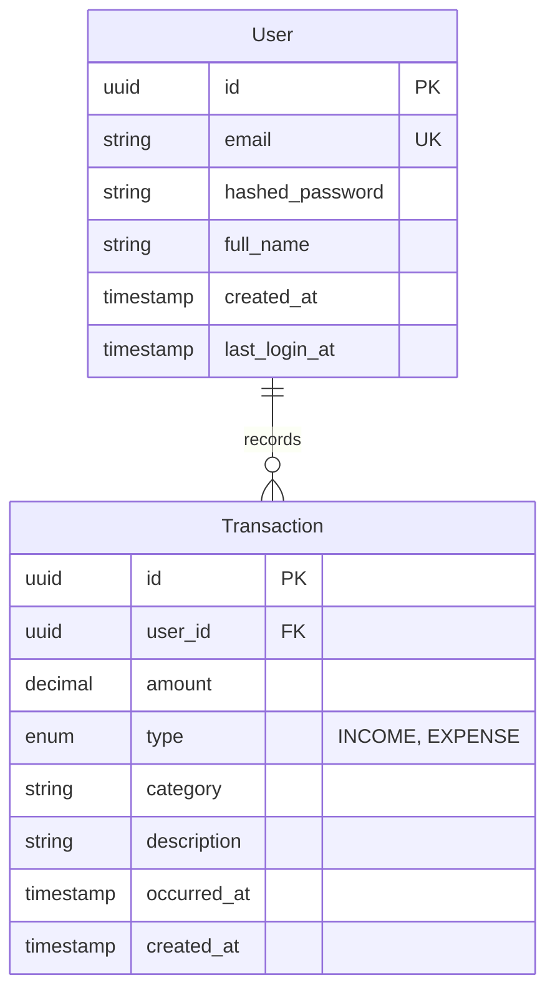

## Ze Finance (Zefa) — Technical Documentation

This document consolidates the technical documentation for the **Ze Finance** project. The system name is **Ze Finance**, and the AI chat assistant is named **Zefa** (masculine). It is designed to be the single starting point for developers and reviewers.

### 1) Product documentation

#### Objective
Build an MVP personal finance assistant focused on a **Walking Skeleton**: a complete, minimal, end-to-end flow that works in the browser (Frontend → API → Database).

#### Target users
- Individuals who want to register, log in, record basic transactions (income/expense), and see a simple financial summary.

#### Core features (MVP)
- **Authentication**
  - Register user
  - Login and obtain JWT token
  - Mobile logout access via account drawer
- **Transactions**
  - List transactions (owned by logged-in user)
  - Create transaction (income/expense) with icon-grid category selection
  - Edit transaction (UI-only, local persistence; backend endpoint pending)
  - Delete transaction (owned by logged-in user)
- **Dashboard**
  - Summary totals (balance, income, expense) and breakdown by category
- **Chat (Preview)**
  - Interactive chat interface with Zefa assistant (masculine)
  - Simulated responses for financial queries
  - Coming soon messaging integrated into chat flow

#### Non-goals (MVP)
- Complex budgeting rules, recurring transactions, multi-currency, bank integrations, or advanced analytics.

---

### 2) User stories and work tickets

#### User stories (format)
Each story should include:
- **Problem / Value**
- **Scope**
- **Acceptance criteria**
- **Out of scope**
- **Dependencies**
- **Test plan**

#### Ticket traceability (minimum fields)
Each ticket should link clearly to:
- **Story ID** (what story is this implementing?)
- **Module** (backend/frontend/infra/docs)
- **Impact** (API change? data model change? UI flow change?)
- **Docs updates** required (which docs and why)

#### Example user story (MVP)
**As a user**, I want to create income/expense transactions, so that I can track my finances and see a summarized dashboard.

**Acceptance criteria**
- User can register and receives a token.
- User can login and receives a JWT token.
- With a valid token:
  - User can create a transaction with `amount`, `type`, `category`, optional `description`, optional `occurred_at`.
  - User can list their own transactions (default limit supported).
  - User can delete their own transactions by `transaction_id`.
  - User can view `/dashboard/summary` with totals and category breakdown.
- Data isolation is enforced: a user cannot read or delete another user’s transactions.

---

### 3) Architecture and data model

#### System architecture diagram (logical)

```mermaid
flowchart LR
  U[User] -->|Browser| FE[Frontend: Next.js 14]
  FE -->|HTTP + JWT| BE[Backend: FastAPI (Async)]
  BE -->|Async SQLAlchemy| DB[(PostgreSQL)]
```

#### Backend architecture (simplified layered)
- **Presentation**: FastAPI routes/controllers (thin)
- **Service/CRUD**: business rules + persistence orchestration
- **Data**: SQLAlchemy models + DB constraints
- **Contracts**: Pydantic schemas define API input/output

#### Data model (MVP)
Authoritative reference: `ai-specs/specs/data-model.md`.



Key constraints and rules:
- **User.email** must be unique.
- **Transaction.user_id** is a foreign key; deleting a user cascades to transactions.
- **Transaction.amount** must be positive; sign is determined by `type`.
- All transactional queries must filter by authenticated `user_id` (logical multi-tenancy).

---

### 4) Backend

#### API contract
Authoritative contract: `ai-specs/specs/api-spec.yml`.

#### Required operations for the main E2E flow
- **Auth**
  - `POST /auth/register` (public) → create user + return token
  - `POST /token` (public, OAuth2 form) → return token
- **Transactions** (protected, require JWT bearer token)
  - `GET /transactions?limit=50` → list user transactions
  - `POST /transactions` → create user transaction
  - `PUT/PATCH /transactions/{transaction_id}` → update user transaction (pending implementation)
  - `DELETE /transactions/{transaction_id}` → delete user transaction
- **Dashboard** (protected)
  - `GET /dashboard/summary` → aggregated totals and category breakdown

**Note:** Transaction editing is currently implemented as local-only in the frontend (with localStorage persistence) until the backend update endpoint is available.

#### Security requirements (MVP)
- Passwords must be stored hashed (never plaintext).
- JWT tokens must expire and be validated on protected routes.
- Enforce ownership checks for all transaction resources.

---

### 5) Frontend

#### E2E user flow (MVP)
The UI does not need to be “ultra polished”, but must be usable, navigable, and coherent.

Minimum navigable flow:
1. Register page → register user → store token
2. Login page → login → store token
3. Dashboard (home) → show summary
4. Transactions list → list transactions
5. Create transaction form → create transaction → refresh list/summary
6. Delete transaction → refresh list/summary

#### UX constraints
- Responsive-first layout across desktop/tablet/mobile (avoid “phone frame” constraints on desktop).
- No `any` types in TypeScript.
- Use a centralized API client (Axios instance) and handle 401 redirect to login.

---

### 6) Test suite

#### Goals
- Verify contracts and business rules for the backend.
- Ensure the “Walking Skeleton” flow is stable end-to-end.

#### Backend tests (recommended minimum)
- **Unit tests**: for pure business rules (if present).
- **Integration tests** (preferred in MVP):
  - Register
  - Login
  - Create transaction (authorized)
  - List transactions (authorized + user isolation)
  - Delete transaction (authorized + ownership)
  - Dashboard summary (authorized)

#### Frontend tests (recommended minimum)
- Lint + typecheck + build are acceptable for MVP.

#### At least one E2E test (main flow)
Minimum E2E scenario (tooling example: Playwright/Cypress):
1. Register a user
2. Login
3. Create an expense transaction
4. Verify it appears in the list and dashboard totals update
5. Delete the transaction
6. Verify it is removed and totals update back

---

### 7) Infra and deployment

#### Local infrastructure
Authoritative setup reference: `ai-specs/specs/development_guide.md` and `backend/README.md`.

**Database Setup (Docker Compose)**
- PostgreSQL 15 is provided via Docker Compose for consistent local development
- Start database: `docker compose up -d db` (from repo root)
- Database credentials (default): `postgres/postgres_password` on `localhost:5433` (port 5433 to avoid conflicts)
- Database name: `zefa_db`
- Optional Adminer UI: `docker compose --profile tools up -d adminer` (access at http://localhost:8080)

**Backend Setup**
- Copy `backend/.env.example` to `backend/.env`
- Install dependencies: `pip install -r requirements.txt`
- Run server: `python -m uvicorn app.main:app --reload --host 0.0.0.0 --port 8000 --env-file .env`
- API available at http://localhost:8000 (docs at `/docs`)

**Frontend Setup**
- Copy `frontend/.env.example` to `frontend/.env.local`
- Install dependencies: `npm install` (from `frontend/` directory)
- Run dev server: `npm run dev` (from `frontend/` directory)
- Frontend available at http://localhost:3000

**Testing**
- Tests use SQLite in-memory database and don't require Docker
- Run tests: `python -m pytest -v` (from `backend/` directory)

#### CI/CD pipeline (basic)
Minimum CI pipeline should run on every PR:
- Backend: lint/format check (if configured), typecheck (if configured), and `pytest` (from `backend/` directory)
- Frontend: `npm run lint` and `npm run build` (from `frontend/` directory)

Recommended CI steps:
- Cache dependencies (pip/npm)
- Run in parallel jobs (backend/frontend)

#### Secrets management (minimum)
- Never commit secrets.
- Use environment files locally (`backend/.env`, `frontend/.env.local`) and CI secrets in the CI provider.
- Provide `.env.example` files for both backend (`backend/.env.example`) and frontend (`frontend/.env.example`) (recommended).

#### Public URL / accessible environment
- Recommended approach:
  - Deploy frontend to a static hosting platform (e.g., Vercel)
  - Deploy backend + DB to a managed platform (e.g., Render/Fly/Railway)
  - Configure CORS (`ALLOWED_ORIGINS`) and API base URL (`NEXT_PUBLIC_API_URL`)

---

### 8) Project standards (enforced by Cursor)

The repo includes Cursor rules to standardize implementation:
- `.cursor/rules/base-standards.mdc`
- `.cursor/rules/backend-standards.mdc`
- `.cursor/rules/frontend-standards.mdc`
- `.cursor/rules/documentation-standards.mdc`

Recommended usage:
- `/plan-backend-ticket` or `/plan-frontend-ticket` for planning
- `/develop-backend` or `/develop-frontend` for implementation
- `/update-docs` for documentation updates

