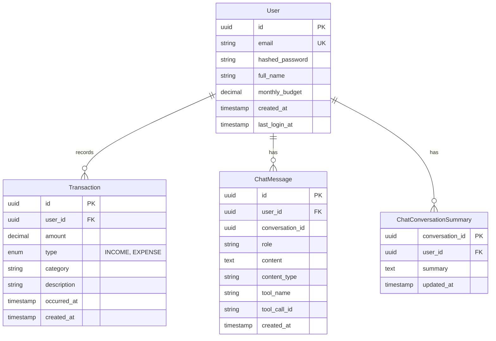

## Ze Finance (Zefa) — Technical Documentation

This document consolidates the technical documentation for the **Ze Finance** project. The system name is **Ze Finance**, and the AI chat assistant is named **Zefa** (masculine). It is designed to be the single starting point for developers and reviewers.

### 1) Product documentation

#### Objective
Build an MVP personal finance assistant focused on a **Walking Skeleton**: a complete, minimal, end-to-end flow that works in the browser (Frontend → API → Database).

#### Target users
- Individuals who want to register, log in, record basic transactions (income/expense), and see a simple financial summary.

#### Core features (MVP)
- **Authentication**
  - Register user
  - Login and obtain JWT token
  - Mobile logout access via account drawer
- **Transactions**
  - List transactions (owned by logged-in user)
  - Create transaction (income/expense) with icon-grid category selection
  - Edit transaction (PATCH backend + UI)
  - Delete transaction (owned by logged-in user)
- **User Profile & Settings**
  - Get/update profile (email, full_name, monthly_budget) via `GET/PATCH /user/profile`
  - Settings page (`/settings`) for editing display name and monthly budget
- **Dashboard**
  - Summary totals (balance, income, expense) and breakdown by category
- **Chat (AI Agent)**
  - Interactive chat interface with Zefa assistant (masculine)
  - Backend-integrated real-time conversations via POST `/chat/messages` (returns message and UI metadata envelope)
  - Natural language queries for financial data
  - Tool-based function calling (get_balance, list_transactions, create_transaction, analyze_spending)
  - Optimistic UI with localStorage persistence (survives browser close/reopen)
  - Markdown GFM rendering for assistant messages (bold, lists, links, code blocks)
  - Theme-aligned bubble colors (primary for user, muted for assistant)
  - Error handling with retry functionality
  - Transaction confirmation cards (powered by chat UI events metadata in response envelope)

#### Non-goals (MVP)
- Complex budgeting rules, recurring transactions, multi-currency, bank integrations, or advanced analytics.

---

### 2) User stories and work tickets

#### User stories (format)
Each story should include:
- **Problem / Value**
- **Scope**
- **Acceptance criteria**
- **Out of scope**
- **Dependencies**
- **Test plan**

#### Ticket traceability (minimum fields)
Each ticket should link clearly to:
- **Story ID** (what story is this implementing?)
- **Module** (backend/frontend/infra/docs)
- **Impact** (API change? data model change? UI flow change?)
- **Docs updates** required (which docs and why)

#### Example user story (MVP)
**As a user**, I want to create income/expense transactions, so that I can track my finances and see a summarized dashboard.

**Acceptance criteria**
- User can register and receives a token.
- User can login and receives a JWT token.
- With a valid token:
  - User can create a transaction with `amount`, `type`, `category`, optional `description`, optional `occurred_at`.
  - User can list their own transactions (default limit supported).
  - User can delete their own transactions by `transaction_id`.
  - User can view `/dashboard/summary` with totals and category breakdown.
- Data isolation is enforced: a user cannot read or delete another user’s transactions.

---

### 3) Architecture and data model

#### System architecture diagram (logical)

```mermaid
flowchart LR
  U[User] -->|Browser| FE[Frontend: Next.js 14]
  FE -->|HTTP + JWT| BE[Backend: FastAPI (Async)]
  BE -->|Async SQLAlchemy| DB[(PostgreSQL)]
```

#### Backend architecture (simplified layered)
- **Presentation**: FastAPI routes/controllers (thin)
- **Service/CRUD**: business rules + persistence orchestration
- **Data**: SQLAlchemy models + DB constraints
- **Contracts**: Pydantic schemas define API input/output

#### Data model (MVP)
Authoritative reference: `ai-specs/specs/data-model.md`.



Key constraints and rules:
- **User.email** must be unique.
- **Transaction.user_id** is a foreign key; deleting a user cascades to transactions.
- **Transaction.amount** must be positive; sign is determined by `type`.
- All transactional queries must filter by authenticated `user_id` (logical multi-tenancy).

---

### 4) Backend

#### API contract
Authoritative contract: `ai-specs/specs/api-spec.yml`.

#### Required operations for the main E2E flow
- **Auth**
  - `POST /auth/register` (public) → create user + return token
  - `POST /token` (public, OAuth2 form) → return token
  - `POST /auth/refresh` (protected) → exchange a valid refresh token (HTTP-only cookie or optional body) for a new access token
  - `POST /auth/logout` (protected) → revoke refresh token and clear the cookie
- **User Profile** (protected)
  - `GET /user/profile` → returns authenticated user's email, full_name, monthly_budget
  - `PATCH /user/profile` → partial update of profile (full_name, monthly_budget)
- **Transactions** (protected, require JWT bearer token)
  - `GET /transactions?limit=50` → list user transactions
  - `POST /transactions` → create user transaction
  - `PATCH /transactions/{transaction_id}` → update user transaction
  - `DELETE /transactions/{transaction_id}` → delete user transaction
- **Dashboard** (protected)
  - `GET /dashboard/summary` → aggregated totals and category breakdown
- **Chat** (protected)
  - `POST /chat/messages` → send message and receive Zefa response with UI metadata
  - `POST /chat/api-key` → set ephemeral provider API key (in-memory, expires in 60 minutes)

#### Security requirements (MVP)
- Passwords must be stored hashed (never plaintext).
- JWT tokens must expire and be validated on protected routes.
- Enforce ownership checks for all transaction resources.
- Refresh tokens must be opaque, hashed at rest in the database, stored with explicit expiry and revocation, and only sent to the client via HTTP-only cookies.

---

### 5) Frontend

#### E2E user flow (MVP)
The UI does not need to be “ultra polished”, but must be usable, navigable, and coherent.

Minimum navigable flow:
1. Register page → register user → store token
2. Login page → login → store token
3. Dashboard (home) → show summary
4. Transactions list → list transactions
5. Create transaction form → create transaction → refresh list/summary
6. Edit transaction → PATCH backend → refresh list/summary
7. Delete transaction → refresh list/summary
8. Settings page (`/settings`) → update profile (name, monthly budget)

#### UX constraints
- Responsive-first layout across desktop/tablet/mobile (avoid “phone frame” constraints on desktop).
- No `any` types in TypeScript.
- Use a centralized API client (Axios instance) and handle 401 redirect to login.

#### Frontend Architecture (Chat Integration)
**Chat Components:**
- `ZefaChatScreen.tsx`: Main chat interface component
- `ChatBubble.tsx`: Individual message bubble with Markdown GFM rendering and status indicators
- `ChatSearchBar.tsx` / `ChatSearchResults.tsx`: In-chat message search
- `ChatMessageAnchor.tsx`: Anchor links for in-message navigation (e.g. to transactions)
- `TypingIndicator.tsx`: "Zefa está digitando..." animation
- `TransactionConfirmationCard.tsx`: Success card for transaction confirmations

**Settings & Filters:**
- `UserSettingsForm.tsx`: Form for editing display name and monthly budget (calls `GET/PATCH /user/profile`)
- `MonthSelector.tsx`: Date filter component for insights/transactions
- `AddToHomeScreenBanner.tsx`: PWA "add to home screen" prompt
- `PullToRefresh.tsx`: PWA pull-to-refresh wrapper (standalone, mobile only) for main content

**State Management:**
- **React Query** (TanStack Query): Caches profile, transactions, and dashboard summary; enables instant navigation with stale-while-revalidate.
- `useChat` hook: Manages messages, conversation ID, typing state, and localStorage persistence
- Hydration gating: Prevents overwriting persisted state on initial mount
- Optimistic UI: User messages appear immediately with "sending" status
- Error handling: Failed messages show retry buttons with user-friendly error messages

**Message Rendering:**
- `react-markdown` + `remark-gfm` for Markdown GFM support
- Renders inline bold (`**text**`), lists, links, code blocks, and line breaks
- Custom component mapping with Tailwind classes for consistent styling
- No raw HTML rendering (security-first approach)

**API Integration:**
- `lib/chat/service.ts`: Normalization layer for backend chat API
- `lib/hooks/useChat.ts`: Chat state, conversation ID, typing, and persistence
- `lib/markdown/remarkHighlightSearch.ts`: Markdown plugin for search highlighting
- Handles timeout (30s), network errors, and 401 redirects
- Ready for future backend format changes (normalized response structure)

**Persistence:**
- localStorage key: `zefa_chat_v1:default` (prepared for user-scoped keys in future)
- Stores conversation ID and messages (with ISO timestamp strings)
- Long-term persistence: Survives browser close/reopen
- Rehydrates on component mount with hydration gating to prevent data loss

#### PWA and Mobile UX

**Chat layout (fixed header and input):**
- The chat uses a simple fixed layout: header is fixed at the top, input is fixed at the bottom.
- Only the messages area scrolls internally; no document or main scroll.
- The "Ver mensagens recentes" button scrolls only the messages container to bottom and does not affect the page.
- No Visual Viewport or keyboard-specific resizing is applied.

**Data cache (stale-while-revalidate):**
- **React Query (TanStack Query)** manages profile, transactions, and dashboard summary with a 60-second `staleTime`.
- Navigating between Dashboard, Transactions, and Insights shows **cached data immediately** when available; skeleton is shown only when no cached data exists.
- Mutations (add/edit/delete transaction) invalidate the relevant queries; background refetch keeps data fresh.

**PWA refresh (standalone mode):**
- When the app runs as an installed PWA (`display: standalone`), the browser chrome (including refresh button) is hidden.
- **Pull-to-refresh** is available in standalone mode on mobile for scrollable main content (Dashboard, Transactions, Insights, Settings). When the user is at the top of the page and pulls down, a "Atualizando…" indicator appears and React Query invalidates profile, transactions, and dashboard summary before refetching (soft refresh).
- A **Refresh** action ("Atualizar") is also available in the **Mobile Account Drawer** (opened from the bottom nav "Conta" button), visible only when running in standalone mode; it performs a full page reload.
- Uses `useIsStandalone()` hook to detect PWA mode (via `matchMedia("(display-mode: standalone)")` and iOS `navigator.standalone`).

#### Security (localStorage and headers)

**Full logout and storage cleanup:**
- On logout (user-initiated or 401 after failed refresh), all keys prefixed with `zefa_` are removed from localStorage via `lib/storage.ts` (`clearAllZefaStorage`).
- Covers: `zefa_token`, `zefa_profile`, `zefa_chat_v1:*`, `zefa_local_edits_v2`, `zefa_pwa_prompt_dismissed_until`.
- Prevents data leakage on shared devices when a user logs out.

**Security headers (Next.js):**
- `X-Content-Type-Options: nosniff`
- `X-Frame-Options: SAMEORIGIN`
- `Referrer-Policy: strict-origin-when-cross-origin`
- `Permissions-Policy` restricting camera, microphone, geolocation
- `Content-Security-Policy` restricting script, style, connect, and frame sources to reduce XSS surface

---

### 6) Test suite

#### Goals
- Verify contracts and business rules for the backend.
- Ensure the “Walking Skeleton” flow is stable end-to-end.

#### Backend tests (recommended minimum)
- **Unit tests**: for pure business rules (if present).
- **Integration tests** (preferred in MVP):
  - Register
  - Login
  - Create transaction (authorized)
  - List transactions (authorized + user isolation)
  - Delete transaction (authorized + ownership)
  - Dashboard summary (authorized)

#### Frontend tests (recommended minimum)
- **Unit/Integration Tests**: Component and utility function tests (Vitest)
- **E2E Tests**: Full user flow tests (Playwright)
- **Test Results**: 86 frontend tests passing
- **Test setup**: Chat integration tests mock `HTMLElement.prototype.scrollTo` and `scrollIntoView` because jsdom does not implement these DOM APIs; the mocks allow components that use them (e.g. ZefaChatScreen) to run without errors.

#### At least one E2E test (main flow)
Minimum E2E scenario (tooling example: Playwright/Cypress):
1. Register a user
2. Login
3. Create an expense transaction
4. Verify it appears in the list and dashboard totals update
5. Delete the transaction
6. Verify it is removed and totals update back

---

### 7) Infra and deployment

#### Local infrastructure
Authoritative setup reference: `ai-specs/specs/development_guide.md` and `backend/README.md`.

**Database Setup (Docker Compose)**
- PostgreSQL 15 is provided via Docker Compose for consistent local development
- Start database: `docker compose up -d db` (from repo root)
- Database credentials (default): `postgres/postgres_password` on `localhost:5433` (port 5433 to avoid conflicts)
- Database name: `zefa_db`
- Optional Adminer UI: `docker compose --profile tools up -d adminer` (access at http://localhost:8080)

**Backend Setup**
- Copy `backend/.env.example` to `backend/.env`
- Install dependencies: `pip install -r requirements.txt`
- Run server: `python -m uvicorn app.main:app --reload --host 0.0.0.0 --port 8000 --env-file .env`
- API available at http://localhost:8000 (docs at `/docs`)

**Frontend Setup**
- Copy `frontend/.env.example` to `frontend/.env.local`
- Install dependencies: `npm install` (from `frontend/` directory)
- Run dev server: `npm run dev` (from `frontend/` directory)
- Frontend available at http://localhost:3000

**Testing**
- Tests use SQLite in-memory database and don't require Docker
- Run tests: `python -m pytest -v` (from `backend/` directory)

#### CI/CD pipeline (basic)
Minimum CI pipeline should run on every PR:
- Backend: lint/format check (if configured), typecheck (if configured), and `pytest` (from `backend/` directory)
- Frontend: `npm run lint` and `npm run build` (from `frontend/` directory)

Recommended CI steps:
- Cache dependencies (pip/npm)
- Run in parallel jobs (backend/frontend)

#### Secrets management (minimum)
- Never commit secrets.
- Use environment files locally (`backend/.env`, `frontend/.env.local`) and CI secrets in the CI provider.
- Provide `.env.example` files for both backend (`backend/.env.example`) and frontend (`frontend/.env.example`) (recommended).

#### Public URL / accessible environment
- **Production stack**: Frontend on **Vercel**, backend on **GCP Cloud Run**, database on **Neon** (PostgreSQL). Full step-by-step guide: `ai-specs/changes/deploy-production-vercel-neon-gcp-plan.md`.
- Configure CORS (`ALLOWED_ORIGINS`) on the backend to the Vercel origin; set `NEXT_PUBLIC_API_BASE_URL` on the frontend to the Cloud Run URL (no trailing slash).
- Backend secrets (e.g. `DATABASE_URL`, `SECRET_KEY`, `GEMINI_API_KEY`) are stored in GCP Secret Manager and mounted into Cloud Run.

---

### 8) Project standards (enforced by Cursor)

The repo includes Cursor rules to standardize implementation:
- `.cursor/rules/base-standards.mdc`
- `.cursor/rules/backend-standards.mdc`
- `.cursor/rules/frontend-standards.mdc`
- `.cursor/rules/documentation-standards.mdc`

Recommended usage:
- `/plan-backend-ticket` or `/plan-frontend-ticket` for planning
- `/develop-backend` or `/develop-frontend` for implementation
- `/update-docs` for documentation updates

