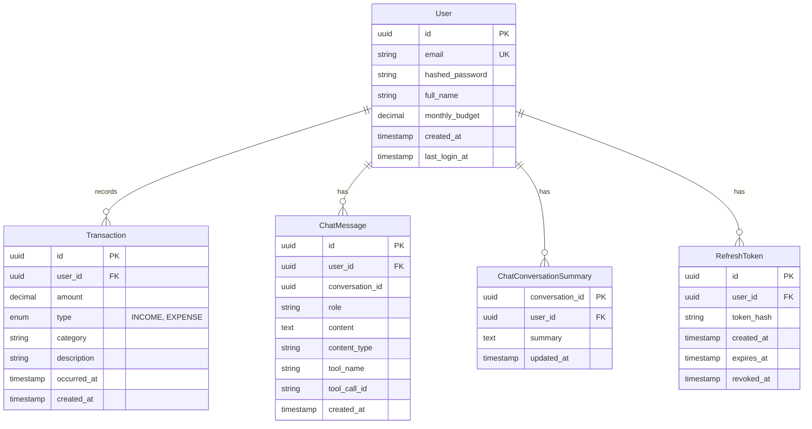

# Data Model (Zefa Finance — MVP)

This document describes the database data model for the Zefa Finance MVP.

## Entity-Relationship Diagram (ERD)

## Entities

### User

Represents a registered user in the system.

- **id** (UUID, PK): generated UUID (v4).
- **email** (string, unique): login identifier.
- **hashed_password** (string): password hash (bcrypt).
- **full_name** (string, nullable): optional display name.
- **monthly_budget** (decimal, nullable): monthly budget for dashboard; defaults to `DEFAULT_MONTHLY_BUDGET` env (5000) at creation.
- **created_at** (timestamp): creation timestamp.
- **last_login_at** (timestamp, nullable): last successful login time.

### Transaction

Represents a financial movement (income or expense) recorded by a user.

- **id** (UUID, PK)
- **user_id** (UUID, FK -> User.id): ownership / multi-tenancy boundary.
- **amount** (numeric/decimal): must be positive; the sign is implied by `type`.
- **type** (enum): `INCOME` or `EXPENSE`.
- **category** (string): free-form in MVP (no category table yet).
- **description** (string, nullable)
- **occurred_at** (timestamp): business date/time.
- **created_at** (timestamp): record creation timestamp.

### ChatMessage

Represents a message exchanged in a chat conversation with Zefa (user/assistant/tool).

- **id** (UUID, PK)
- **user_id** (UUID, FK -> User.id): ownership / isolation.
- **conversation_id** (UUID): conversation grouping key.
- **role** (string): `system`, `user`, `assistant`, `tool`.
- **content** (text)
- **content_type** (string): `text` (MVP) and internal tool/system types.
- **tool_name** (string, nullable): tool identifier (when role is `tool`).
- **tool_call_id** (string, nullable): correlation id for tool call results.
- **created_at** (timestamp)

### ChatConversationSummary

Stores a rolling summary of older messages for a conversation (memory optimization).

- **conversation_id** (UUID, PK)
- **user_id** (UUID, FK -> User.id)
- **summary** (text)
- **updated_at** (timestamp)

### RefreshToken

Represents a long-lived opaque token used to obtain new access tokens without re-entering credentials.

- **id** (UUID, PK)
- **user_id** (UUID, FK -> User.id): owner of the refresh token.
- **token_hash** (string): deterministic one-way hash of the raw refresh token (raw value is never stored).
- **created_at** (timestamp): creation time.
- **expires_at** (timestamp): absolute expiry for the refresh token.
- **revoked_at** (timestamp, nullable): revocation time (when set, the token can no longer be used).

## Constraints and notes

- **Email uniqueness** is enforced at the database level.
- **Data isolation** is enforced by always scoping queries by authenticated `user_id`.
- **Cascade delete**: deleting a user cascades to transactions and chat records.
- **Indexes**: the implementation includes indexes to speed up common list and summary queries
  (e.g., `(user_id, occurred_at)` for transactions and `(user_id, conversation_id, created_at)` for chat messages).

